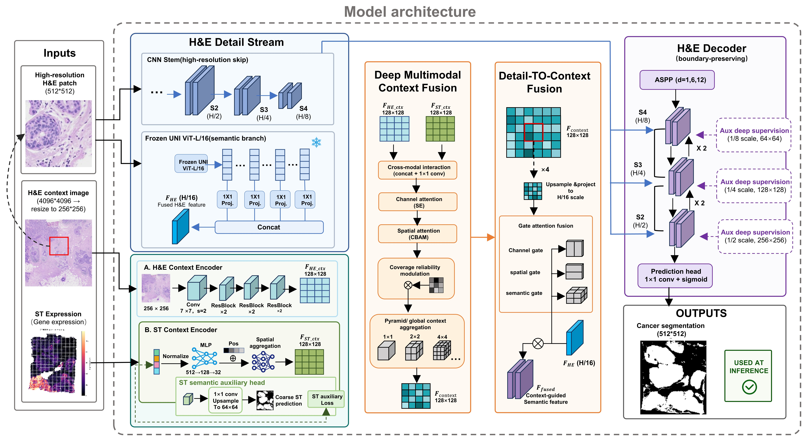

# HiST-Seg
## Introduction
Pixel-wise segmentation of cancerous tissue regions (CTRs) is important for pathological assessment and spatial molecular analysis. Existing methods fall into two categories: one identifies abnormal regions solely from histology images, while the other integrates histology with spatial transcriptomics (ST) data for spot-level CTR prediction. However, histology-only models lack molecular evidence, whereas spot-level methods are constrained by the coarse spatial resolution of ST and fail to recover precise CTR boundaries.
We propose HiST-Seg, a context--detail dual-stream framework for pixel-wise CTR segmentation using ST data and H\&E-stained images. Specifically, its detail stream extracts fine-grained morphological information and boundary cues from high-resolution H\&E patches via a pretrained pathology encoder and multi-scale convolutional features. In parallel, its context stream jointly encodes a large-field-of-view H\&E image and a dense ST feature map constructed from spot-level transcriptomic representations. An adaptive cross-resolution fusion mechanism integrates local pathological semantics with tissue-level morphological and molecular context, followed by a context-guided decoder that progressively reconstructs fine CTR boundaries.
HiST-Seg can be trained on multiple source tissue sections of the same cancer type and directly applied to unseen target sections without target-specific fine-tuning. Experiments on four spatial transcriptomics datasets covering 22 tissue sections from breast cancer and colorectal cancer (CRC) demonstrate that HiST-Seg achieves superior performance in both CTR segmentation and cross-section generalization.



## Requirements
All experiments were conducted on an NVIDIA RTX 3090 GPU. Before running SpaMCAF, you need to create a conda environment and install the required packages:
```shell
conda create -n HISTEX python==3.10.15
conda activate SpaMCAF
pip install -r requirements.txt
```

## Datasets
we have curated all six datasets and their respective spot-level labels used across our evaluations and these resources are hosted on Zenodo (\url{https://zenodo.org/records/18205677}).

The ST human HER2-positive breast tumor datasets (STHBC) are available in: [https://github.com/almaan/her2st](https://github.com/almaan/her2st).

The 10X Visium Human Breast Cancer Breast Cancer: Ductal Carcinoma In Situ, Lobular carcinoma In Situ, Invasive Carcinoma dataset (ViHBC) are available in: [https://www.10xgenomics.com/datasets/human-breast-cancer-block-a-section-1-1-standard-1-1-0](https://www.10xgenomics.com/datasets/human-breast-cancer-block-a-section-1-1-standard-1-1-0).

The Xenium Human Breast Cancer dataset (XeHBC) can be found at: [https://www.10xgenomics.com/products/xenium-in-situ/preview-dataset-human-breast](https://www.10xgenomics.com/products/xenium-in-situ/preview-dataset-human-breast).

The 10X Visium Human Breast Cancer: Ductal Carcinoma In Situ, Invasive Carcinoma dataset (DuCIS) are available in: [https://www.10xgenomics.com/datasets/human-breast-cancer-ductal-carcinoma-in-situ-invasive-carcinoma-ffpe-1-standard-1-3-0](https://www.10xgenomics.com/datasets/human-breast-cancer-ductal-carcinoma-in-situ-invasive-carcinoma-ffpe-1-standard-1-3-0).

The 10X Visium Colorectal Cancer Visium datasets (CRC) are available in: [https://zenodo.org/records/7760264](https://zenodo.org/records/7760264).

The 10X Visium Colorectal Cancer Visium datasets (ST_colon) are available in:[https://www.biosino.org/node/project/detail/OEP001756](https://www.biosino.org/node/project/detail/OEP001756).


## Pre-trained general-purpose foundation mode
Given the outstanding performance of large pre-trained general-purpose foundation models in clinical tasks, we use UNI as the backbone feature extractor. Before using SpaMCAF, you need to apply to UNI for permission to access the model weights: [https://huggingface.co/mahmoodlab/UNI](https://huggingface.co/mahmoodlab/UNI).

## HiST-Seg pipeline
- Install the UNI module form [https://github.com/mahmoodlab/UNI](https://github.com/mahmoodlab/UNI).
- Run train.py
- Run test.py

